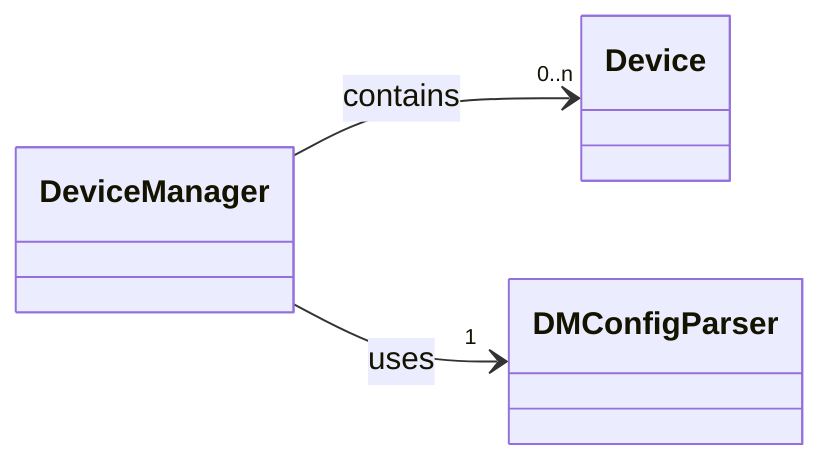

# Architectural Overview

An overview of this package's architecture.

---

## The Device Manager

The [`DeviceManager`][tm_devices.DeviceManager] class is the backbone of this package. It is what
facilitates connections to different devices and is responsible for correctly
selecting the driver for the device being connected to. The
[`DeviceManager`][tm_devices.DeviceManager]
keeps a mapping of all devices in use and provides access to the driver for each
active device. The device driver is what is responsible for communication with
the physical device and also contains useful attributes, which contain
information about the device, and methods, which provide various functionality.

The [`DeviceManager`][tm_devices.DeviceManager] uses a configuration parser
([`DMConfigParser`][tm_devices.components.DMConfigParser]) to read in
connection information from an optional [config file](../configuration.md#config-file) or
[environment variable](../configuration.md#environment-variable) as well as to store
connection information that is provided directly via [python code](../configuration.md#python-code).
This information contains the device type (e.g., SCOPE, AFG, SMU) as well as the address
(e.g., hostname, IP address, or model and serial number for USBTMC). The config parser also reads in
optional configuration settings that apply globally, such as turning on verbose VISA logging. The
[`DeviceManager`][tm_devices.DeviceManager] then connects to all the devices that the config parser
has listed and provides access to the [Python driver](#device-drivers) for each device. The
Python device driver is the class responsible for actual communication with the physical
(or virtual) device.

### Block Diagram

---

## Device Types

These are the currently supported device types:

1. Arbitrary Function Generators (AFGs)
2. Arbitrary Waveform Generators (AWGs)
3. Data Acquisition Systems (DAQs)
4. Digital Multimeters (DMMs)
5. Margin Testers
6. Power Supplies (PSUs)
7. Scopes (Oscilloscopes)
8. Source Measure Units (SMUs)
9. Systems Switches

### Block Diagram

{{ auto_class_diagram('tm_devices.drivers.device.Device', full=False, namespace='tm_devices.drivers', tree_direction='down') }}

---

## Device Drivers

### Object-Oriented Design Principles

The drivers are the biggest part of this package; each unique series of instrument gets a uniquely
named Python driver class (see [`tm_devices.drivers`][tm_devices.drivers] for the list of
available driver classes). These classes are implemented using object-oriented programming
principles and make extensive use of inheritance. This allows common attributes and methods to be
defined in higher-level, abstract classes that are then inherited by the individual driver classes.

Mixin classes are also used to provide shared implementations and abstract method signatures for the
drivers. This allows multiple device types to all inherit from the same abstract class (mixin class)
without sharing the exact same inheritance tree (since they might not share much else). The mixin
classes define attributes and methods, some of which the driver will overwrite or implement for itself.

### Family Base Classes

One other technique for enabling code reuse in the drivers is by using a “family base class”. Each
family base class is an abstract class that defines the signature for all child classes that
inherit from it. Occasionally a child class will need to overwrite an implementation due to the
differences that can occur between different models of the same device type, but the class signature
will not change. This means that all drivers that inherit from a common family base class are
guaranteed to have the same class signature (attributes, methods, etc.), and this rule is enforced by unit tests.

### Object-Oriented Design Benefits

These object-oriented principles result in individual driver classes that are quite simple to
read, as they have very few actual lines of code. Code duplication is extremely low, which makes
drivers easy to create and update.

### Block Diagram

This package supports many devices, zoom in to see them all!

!!! note

    - Family Base Classes are outlined in **orange red**.
    - Device Drivers are highlighted in **lawn green**.

{{ auto_class_diagram('tm_devices.drivers', full=True, namespace='tm_devices.drivers', highlight_family_base_classes=True, highlight_device_drivers=True, chart_direction='LR') }}
